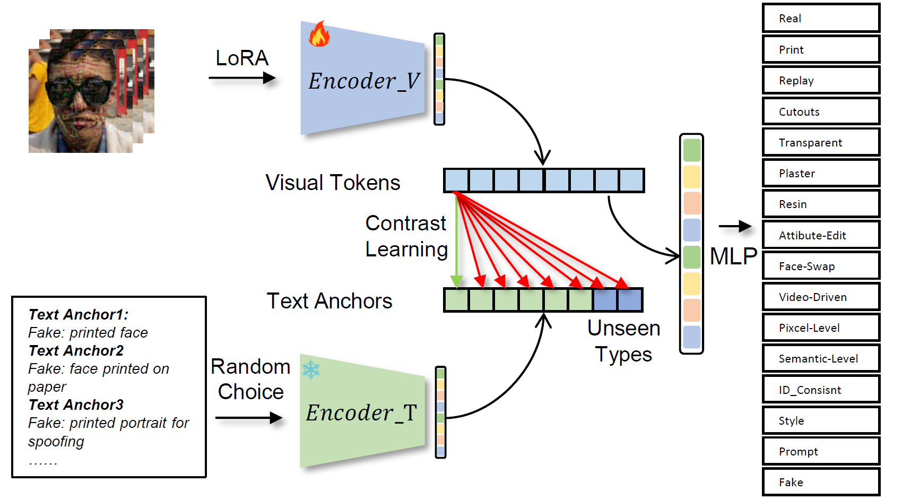

# Applying Semantic Anchor in Face Anti-Spoofing Detection for Unified Physical-Digital Attacks[ICCV2025 workshop 6th FAS Challenge]
This repository is the official implementation of **Applying Semantic Anchor in Face Anti-Spoofing Detection for Unified Physical-Digital Attacks** in ICCV2025 FAS workshop.

## Overview
In this work, we presented a novel Semantic Anchor framework for unified physical and digital face anti-spoofing detection. By leveraging the semantic power of vision-language models and a targeted contrastive learning strategy, our method effectively handles a wide range of spoofing attacks. The core novelty lies in our approach to generalization, where we incorporate semantic anchors of unseen attack types into the training process to prepare the model for future threats. Complemented by a robust generative data augmentation pipeline, our framework achieves state-of-the-art performance.


<center> Overview of the proposed framework. </center>

## Requirements
### Hardware
GPU: A800 80G
### Environment
```
pip install -r requirements.txt
```
## Dataset Preparation
We use official datasets for training and evaluation. Additionally, following the challenage guideline, we used some training dataset to generate synthetic images for model training.
We generated additional training data based on the official dataset. If you would like to use these extra data for training, please contact us at yangxu2001 #at# stu.xjtu.edu.cn.
The default dataset path is:  ```/workspace/iccv2025_face_antispoofing```. All data and annoations should be placed in this path.

## Train
### Pre-trained Models
We used pretrained [CLIP](https://github.com/openai/CLIP) ViT-L-14 as our backbone model. You can download the pretrained model ```ViT-L-14.pt``` and place it in ```./weight/clip/```.

### Training on single GPU
```bash
python train.py configs/clip_vit14_text_anchor_224.py --gpus 1
```
The results will be saved in ```./output/best_results``` which conontains the models and training logs.
Here we provide our trained result ckpt in [baiduyun](https://pan.baidu.com/s/10cPPAA9vjLcXrYWnfCrVCA?pwd=rvu3).

## Inference
```bash
python infer.py configs/clip_vit14_text_anchor_224.py --load_from ./output/best_results/epoch4_iter850.pth --work_dir ./output/best_results --gpus 1
```
The results text file of val and test dataset will be saved in ```./output/best_results/results``` .

## Citation
tbd